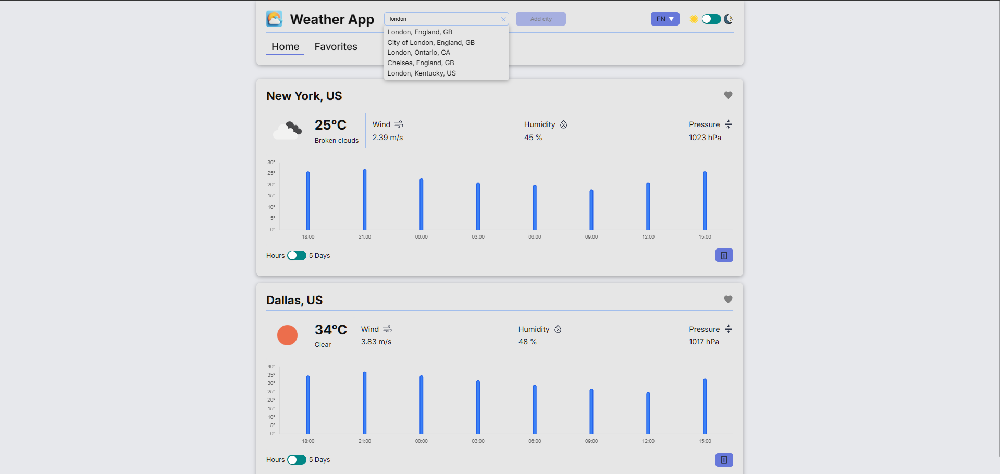
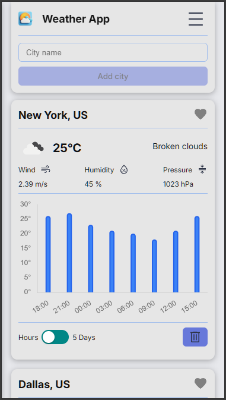
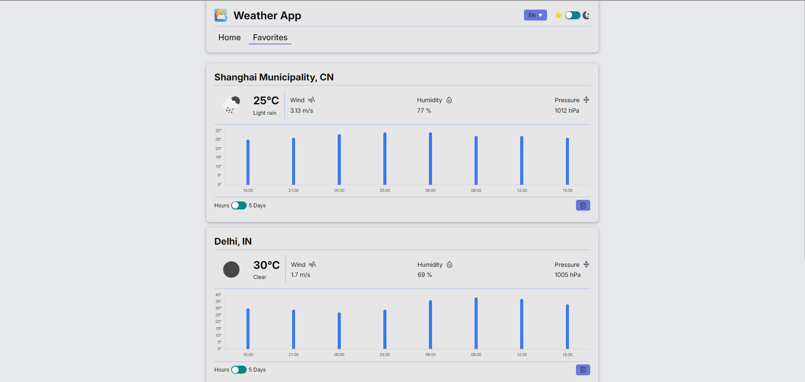
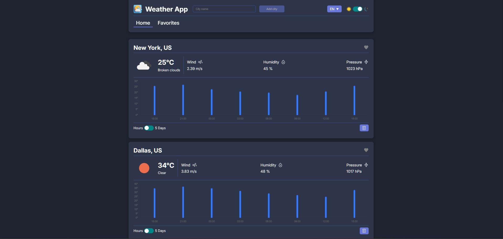

# Weather App

A modern weather application built with **Vue 3** and **TypeScript**, providing current weather information, hourly and 5-day forecasts, city search, favorites, localization, and theme switching.

The project was built with a focus on **component reusability, separation of concerns, type safety, and clean state management**.

## 🔗 Live Demo

**[Open Weather App](https://weather-app-slepo.vercel.app/)**

## 📸 Screenshots

### Home — Desktop




### Home — Mobile




### Favorites




### Dark Theme




> **Screenshot setup:** Create a `screenshots` folder in the project root and place the four images there using the filenames shown above.

## ✨ Features

* 🌤️ Current weather information
* 📊 Hourly temperature forecast for the next 24 hours
* 📅 5-day temperature forecast
* 🔎 City search with autocomplete
* 📍 Automatic location detection

  * Browser Geolocation API
  * IP-based location fallback
* ⭐ Favorite cities
* 🌍 English and Ukrainian localization
* 🌙 Dark and light themes
* 💾 Persistent favorites using `localStorage`
* 🔄 User city caching using `sessionStorage`
* ⏳ Loading skeletons
* 🔔 User notifications
* 🗑️ Confirmation dialogs before removing cities
* 📱 Responsive layout
* ➕ Up to 5 weather cards
* ⭐ Up to 5 favorite cities

## 🛠️ Tech Stack

### Core

* **Vue 3**
* **TypeScript**
* **Vite**
* **Vue Router**
* **Pinia**

### UI & Styling

* **SCSS**
* CSS custom properties
* Custom reusable UI components
* Responsive layout

### Data & API

* **Axios**
* **OpenWeather API**
* **ipapi.co**
* Browser Geolocation API

### Additional Libraries

* **Chart.js** — weather data visualization
* **Vue I18n** — localization
* **Lodash** — input debouncing
* **vite-svg-loader** — SVG imports

## 📱 Application Overview

The application is divided into two main sections:

### Home

The home page displays weather cards for selected cities. A city can be searched using the autocomplete field and added to the list.

Each weather card contains:

* City and country
* Current temperature
* Feels-like temperature
* Weather condition
* Weather icon
* Precipitation probability
* Wind speed
* Humidity
* Atmospheric pressure
* Temperature chart
* Favorite toggle
* Remove action

The temperature chart can be switched between:

* **Hourly** — temperature changes over the next 24 hours
* **5 Days** — average daily temperatures

### Favorites

Favorite cities are stored locally and restored after reopening the application.

The Favorites page fetches fresh weather data for all saved cities when opened.

The application supports a maximum of **5 favorite cities**.

## 🌍 Localization

The application supports two languages:

* English
* Ukrainian

Localization is implemented with **Vue I18n**.

Weather conditions returned by the API are mapped to localized application strings, allowing the UI to remain independent from the API response language.

## 📍 Location Detection

When the application is opened for the first time, it attempts to determine the user's location.

The resolution strategy is:

1. Check cached user location in `sessionStorage`
2. Request the browser's Geolocation API
3. If geolocation is unavailable or denied, fall back to IP-based location detection
4. Fetch weather data using the resolved coordinates

This allows the application to provide useful weather information without requiring the user to manually search for their city.

## ⭐ Favorites

Users can add cities to their favorites directly from weather cards.

Favorite data is stored in `localStorage` and contains only the information required to restore the cities:

```ts
{
  id: number;
  name: string;
  lat: number;
  lon: number;
  country: string;
}
```

Weather data itself is **not persisted**. Instead, fresh forecast data is requested when the Favorites page is loaded.

The application supports a maximum of **5 favorite cities**.

## 🧠 State Management

Application state is managed with **Pinia**.

The main stores are:

### Weather Store

Responsible for:

* City search results
* Selected city
* User location
* Weather data
* Loading states
* Weather fetching
* City management

### Favorites Store

Responsible for:

* Favorite cities
* Favorite city weather data
* Adding/removing favorites
* Favorite persistence
* Loading weather for favorite cities

### Theme Store

Responsible for:

* Current theme
* Theme initialization
* System theme detection
* Theme switching
* Theme persistence

## 🏗️ Project Structure

```text
src/
├── adapters/
│   ├── city.adapter.ts
│   └── cityByIP.adapter.ts
│
├── api/
│   ├── index.ts
│   └── weather/
│       ├── index.ts
│       └── models.ts
│
├── components/
│   ├── AppHeader/
│   ├── Favorites/
│   ├── Main/
│   │   ├── TemperatureChart.vue
│   │   ├── WeatherCard.vue
│   │   └── WeatherCardSkeleton.vue
│   └── UI/
│
├── composables/
│
├── constants/
│
├── i18n/
│   ├── en.json
│   ├── uk.json
│   └── index.ts
│
├── layouts/
│
├── pages/
│   ├── Favorites/
│   └── Home/
│
├── router/
│
├── services/
│   ├── geolocation.ts
│   ├── userCityStorage.ts
│   └── useFavoriteCitiesStorage.ts
│
├── stores/
│   ├── favorites/
│   ├── theme/
│   └── weather/
│
├── styles/
│
├── App.vue
└── main.ts
```

The project separates responsibilities between:

* **API layer** — communication with external services
* **Adapters** — transforming external API data into application models
* **Stores** — application state and business logic
* **Services** — browser APIs and persistence
* **Components** — reusable UI elements
* **Pages** — page-level composition
* **Constants** — application configuration
* **i18n** — localization resources

## 🔌 API

The application uses the following services:

### OpenWeather

Used for:

* City geocoding
* Current weather data
* 5-day forecast data

The application requests weather data using geographic coordinates and metric units.

### IPAPI

Used as a fallback for determining the user's approximate location when browser geolocation is unavailable.

### Browser Geolocation API

Used as the primary method for detecting the user's location.

## 🔐 Environment Variables

Create a `.env` file in the project root:

```env
VITE_OPENWEATHER_API_KEY=your_api_key
```

The API key is used by the application's Axios configuration.

> Never commit your `.env` file or expose private API credentials in the repository.

## 🚀 Getting Started

### Prerequisites

* Node.js 20+
* npm

### Installation

Clone the repository:

```bash
git clone https://github.com/slepo99/Weather-App.git
cd Weather-App
```

Install dependencies:

```bash
npm install
```

Create your `.env` file and add your OpenWeather API key.

Start the development server:

```bash
npm run dev
```

The application will be available at the local Vite development URL.

## 📦 Production Build

Create a production build:

```bash
npm run build
```

Preview the production build locally:

```bash
npm run preview
```

## 🧩 Architecture Highlights

### Typed API Models

External API responses are represented using TypeScript interfaces before being transformed into application-specific models.

This keeps API-specific structures isolated from the rest of the application.

### Data Adapters

API responses are transformed through adapters before entering the application state.

For example, city search results are converted into a normalized application model containing the information required by the UI.

### Weather Data Formatting

Raw forecast data is processed by a dedicated formatting layer.

It extracts:

* Current weather information
* Next 24-hour temperature data
* Average daily temperatures
* Coordinates
* Weather condition metadata

This keeps data transformation logic outside of presentation components.

### Reusable UI Components

The application uses reusable components for common interface elements such as:

* Buttons
* Inputs
* Modals
* Notifications
* Weather cards
* Loading skeletons
* Charts

This makes the UI easier to maintain and reuse across pages.

## 💡 UX Considerations

Several states are explicitly handled throughout the application:

* Initial loading
* Weather loading
* City search
* Empty city lists
* Empty favorites
* City not found
* Duplicate cities
* Maximum city limit
* Maximum favorites limit
* Confirmation before deletion
* Failed location detection

Loading skeletons are used instead of leaving the interface empty while weather data is being requested.

## 📱 Responsive Design

The interface is designed to adapt to different viewport sizes using responsive SCSS and predefined breakpoints.

The application supports:

* Mobile
* Tablet
* Desktop

## 🌐 Deployment

The application is deployed using **Vercel**.

**Production:** [weather-app-slepo.vercel.app](https://weather-app-slepo.vercel.app/)

Every new commit pushed to the production branch can trigger a new deployment through the configured Vercel integration.

## 📄 License

This project was created as a personal portfolio project.
